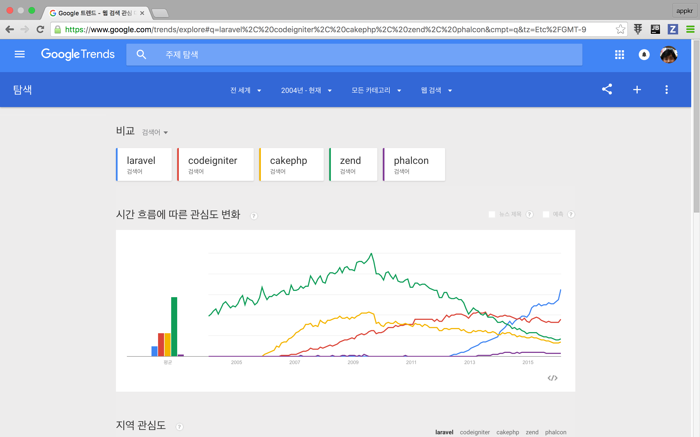

## IV. 라라벨은?

### IV.1. 라라벨의 철학

- 라라벨의 설치-개발-배포 전 과정이 쉽고 즐거워야 한다.
- 매번 반복되는 일은 라라벨이 대신한다.
- 개발자는 핵심 업무에만 집중해야 한다.

웹 개발자의 핵심 업무는 아이디어를 웹 서비스로 만드는 일이다.

### IV.2. 라라벨의 성장 과정

테일러 오트웰[^i-7]은 라라벨 프레임워크를 왜 만들었을까?

새로운 프로젝트를 할 때마다 반복해서 구현해야 하는 기능이 있다. 대표적인 기능이 사용자 모델 및 인증이다. 당시 가장 인기 있 PHP 웹 프레임워크에는 이 기능이 빠져 있었다. 테일러 오트웰은 이점에 착안하고, 회사에서 개발하던 웹 프레임워크를 잘 포장해서 2011년 6월 세상에 공개했다. 첫 버전이었다.

버전 1은 사용자 인증, 클로저를 이용한 라우팅, 엘로퀀트 등의 기능을 담고 있었다. 같은 해 11월에 발표한 두 번째 버전에서는 MVC 구조를 채택했다. 바로 이듬해 2월에 세 번째 버전을 발표했다. 버전 3에서는 아티즌 명령줄 인터페이스와 데이터베이스 마이그레이션 외 많은 기능이 추가되었다. 버전 3 출시 후 다른 PHP 프레임워크에 기여하던 개발자가 대거 라라벨 팀에 합류했다. 저자도 이때 라라벨을 처음 접했다.

버전 3는 번들(`bundle`)이라는 자체적인 확장 관리 도구를 가지고 있었다. 그런데 이즈음 PHP 세계에 큰 사건 일어났다. 바로 컴포저(composer)의 등장이다. 라라벨 팀은 컴포저를 이용하는 구조로 프레임워크를 완전히 다시 썼다.

새로운 버전은 2013년 5월에 공개됐다. 버전 4부터 현재의 구조, 즉 `laravel/laravel`과 `laravel/framework`로 분리된 형태를 가졌다. 이 버전에서는 파사드, 데이터베이스 시딩, 큐, 메일 등 고급 웹 프로그래밍을 위한 기능들이 포함되었다.

다섯 번째 버전은 2015년 2월에 공개됐다. 가장 큰 변화는 네임스페이스와 PSR-4 오토로딩 적용이다. 이제 클래스 이름 충돌 걱정 없이 외부 컴포넌트를 가져와서 프레임워크의 기능을 자유롭게 확장할 수 있게 됐다.

### IV.3. 라라벨의 인기

왜 많은 개발자들이 라라벨을 가장 좋아하는 PHP 웹 프레임워크라고 말할까?

그림 iv-1 구글 트렌드로 본 라라벨의 인기 (2016-02-23 기준)

아래 목록은 라라벨 인기 비결에 관한 저자의 주장이다.

1.  다른 언어 또는 다른 PHP 웹 프레임워크에서 활동하던 유명 개발자들의 참여[^i-8]
2.  프레임워크 자체의 우수성
    - 쉽고 고급스러운 문법
    - 미리 만들어 놓은 내장 기능_ 사용자 인증, 캐시 등
    - 강력한 확장 기능들_ 홈스테드(homestead), 소셜라이트(socialite) 등
    - PSR 표준 준수
    - 최신 웹 개발 방법론 적용
3. 라라벨을 이용한 개발 생산성(개발 기간 단축)

라라벨 프로젝트를 한번만 해보면 저자의 주장에 동의할 것이다.

### IV.4. 커뮤니티와 리소스

라라벨 개발자를 위한 온라인 리소스들이다. 라라벨에 입문한 후, 더 고급 개발자로 나아가려면 꼭 살펴보기 바란다.

- 라라벨 뉴스[^i-9]_ 라라벨 관련 뉴스 블로그
- 라라캐스트[^i-10]_ 동영상 강의 서비스. 매주 2~3 개의 강의가 올라오며, 수백 편의 기존 동영상 강의를 볼 수 있다 ($10/월). 게다가 라라벨 커뮤니티에서 가장 활발한 포럼을 운영한다(포럼 참여는 무료).

국내에서도 라라벨로 향하는 관심이 서서히 높아지고 있다.

- 우리말로 된 라라벨 5 매뉴얼 및 포럼[^i-12]
- 페이스북 그룹[^i-14]_ 라라벨 관련 소식 공유
- 모던 PHP 사용자 그룹[^i-15]
- PHP THE RIGHT WAY 한글 번역[^i-16]_ 모던 PHP 개발 방법론 학습을 위해 꼭 읽어볼 것을 권장한다.

[^i-7]: 테일러 오트웰(Taylor Otwell)_ http://taylorotwell.com

[^i-8]: 데일 리즈(Dayle Rees), 그레이엄 캠벨(Graham Campbell), 에릭 반즈(Eric Barnes), 제프리 웨이(Jeffrey Way), 맷 스터퍼(Matt Stauffer) 외

[^i-9]: 라라벨 뉴스_ https://laravel-news.com

[^i-10]: 라라캐스트_ https://laracasts.com

[^i-12]: 라라벨 5 한국어 매뉴얼 및 포럼_ http://laravel.kr

[^i-14]: 페이스북 그룹_ https://www.facebook.com/groups/laravelkorea

[^i-15]: 모던 PHP 사용자 그룹_ http://www.modernpug.org

[^i-16]: PHP THE RIGHT WAY_ http://modernpug.github.io/php-the-right-way
