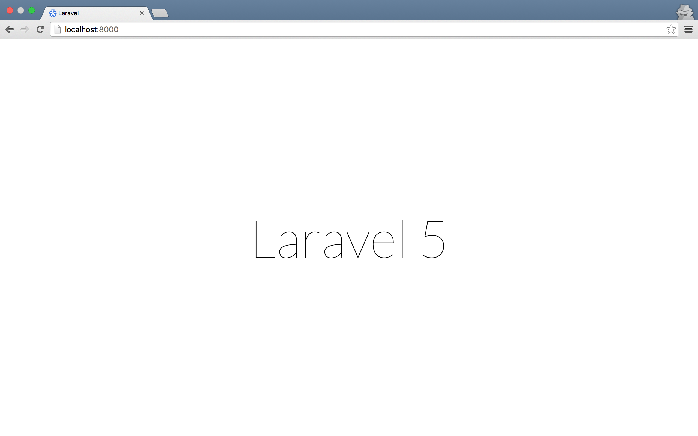
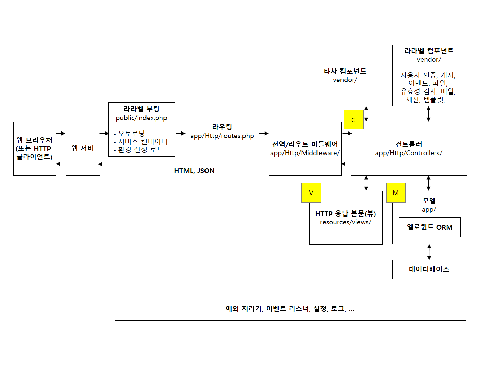

## 1장 라라벨 설치

### 1.1. 새로운 라라벨 프로젝트 만들기 

```sh
# 콘솔 1-1 라라벨 설치

# --verbose 옵션은 생략해도 좋다. 설치 과정을 좀 더 자세히 화면에 출력 위한 옵션이다.
$ composer create-project laravel/laravel myapp --prefer-dist --verbose
```

#### 1.1.1. 설치 확인

```sh
# 콘솔 1-2 라라벨 설치 확인

$ cd myapp
$ php artisan --version 
# Laravel Framework version 5.3.x
# laravel/laravel의 버전이 아니고, laravel/framework의 버전이다.
```

```sh
# 콘솔 1-3 로컬 서버 구동

$ php artisan serve
# Laravel development server started on http://localhost:8000/
```



그림 1-1 크롬, 라라벨 환영 페이지

### 1.2. 라라벨 프로젝트 구조

각 디렉터리가 하는 일을 간략히 설명한다. 지금 당장 이해되지 않는다고 실망하지 말자. 이 책을 다 읽고 나서, 이 페이지를 다시 펴본다면 이해할 수 있을 것이다.

```sh
.
├── .env                              # 글로벌 설정 중 민감한 값, 
│                                     # 서비스 실행 환경(개발/운영)에 따라 달라져야 하는 값을 써 놓는 곳
├── app
│   ├── Console                       
│   │   ├── Commands                  # 우리가 만든 콘솔 명령을 담는 디렉터리
│   │   └── Kernel.php                # 콘솔 명령, 크론 작업을 등록하는 레지스트리
│   ├── Events                        # 우리가 만든 이벤트 클래스를 담는 디렉터리
│   ├── Exceptions                    # 우리가 만든 예외(Exception) 클래스를 담는 디렉터리
│   │   └── Handler.php               # 전역 예외 처리 규칙을 정의한 클래스
│   ├── Http                          # HTTP 요청을 처리하는 클래스들을 담는 디렉터리
│   │   ├── Controllers               # HTTP 요청을 처리하는 컨트롤러를 담는 디렉터리
│   │   ├── Kernel.php                # HTTP 요청 처리를 위해 기본이 되는 커널
│   │   ├── Middleware                # 미들웨어를 담는 디렉터리
│   │   ├── Requests                  # HTTP 폼 리퀘스트를 담는 디렉터리
│   │   └── routes.php                # 요청 URL과 처리 로직(컨트롤러)을 연결하는 매핑 테이블
│   ├── Jobs                          # 큐 작업 처리기를 담는 디렉터리 
│   ├── Listeners                     # 이벤트 리스너를 담는 디렉터리
│   ├── Policies                      # 접근 권한 제어를 위한 정책들을 담는 디렉터리 
│   ├── Providers                     # 서비스 프로바이더(service provider)를 담는 디렉터리 
│   │   ├── AppServiceProvider.php    # 우리가 만든 서비스를 서비스 컨테이너에 등록하기 위한 클래스 
│   │   ├── AuthServiceProvider.php   # 사용자 인가와 관련된 정책을 등록하기 위한 클래스
│   │   ├── EventServiceProvider.php  # 이벤트와 이벤트 처리기를 연결하는 클래스
│   │   └── RouteServiceProvider.php  # routes.php 에서 정의한 라우팅을 활성화하는 클래스 
│   └── User.php                      # 기본 내장 User 모델
├── composer.json                     # 이 프로젝트의 의존성 레지스트리
├── config                            # 데이터베이스, 큐, 메일 등 전역 설정을 담는 디렉터리
├── database
│   ├── migrations                    # 이 프로젝트의 데이터베이스 테이블 스키마를 담는 디렉터리 
│   └── seeds                         # 데이터베이스 테이블에 더미 데이터를 삽입하는 클래스들을 담는 디렉터리
├── gulpfile.js                       # 엘릭서(elixir, 프런트 엔드 빌드 자동화) 스크립트
├── public                            # 웹 서버 루트(document root)
├── resources
│   ├── assets                        # 엘릭서 빌드 전의 원본 자바스크립트, CSS 등을 담는 디렉터리
│   ├── lang                          # 다국어 지원을 위한 언어별 사전을 담는 디렉터리
│   └── views                         # 뷰 파일을 담는 디렉터리
├── storage                           # 라라벨의 파일 저장소 (캐시, 로그 등)
├── tests                             # 테스트 파일을 담는 디렉터리
└── vendor                            # 이 프로젝트가 의존하는 컴포넌트를 담는 디렉터리
```

우리가 새로 만든 라라벨 프로젝트는 크게 네 부분으로 나눌 수 있다.

1. 우리가 직접 개발한 애플리케이션 레이어 (`acme/myapp`이라고 하자.)
2. `laravel/laravel` 라라벨 프레임워크. 아래 '라라벨 핵심 컴포넌트'와 '타사 컴포넌트'를 잘 조합하여 웹 서비스를 만들 수 있는 기본 틀
3. `laravel/framework` 라라벨 핵심 컴포넌트 (파운데이션 또는 커널이라 부르기도 함)
4. 타사 컴포넌트


그림 1-2 라라벨 프로젝트 구조

우리가 앞으로 만들 부분이 1이다. 콘솔 1-1의 명령은 2를 설치한 것이다. 새로 만든 프로젝트의 `composer.json` 파일을 열어 보면 3과 4를 요구한다는 내용이 선언되어있다. 최종으로 설치된 내용은 2+3+4다.

```javascript
// 코드 1-1 composer.json

{
  "require": {
    "php": ">=5.5.9",
    "laravel/framework": "5.2.*"
  },
  "require-dev": {
    "fzaninotto/faker": "~1.4",
    // "...",
  }
}
```

### 1.3. 라라벨 작동 원리



그림 1-3 라라벨로 만든 웹 서비스의 작동 원리

### 1.4. 버전 관리

```sh
# 콘솔 1-4 깃을 이용한 버전 관리

$ git init
# Initialized empty Git repository in /path/to/myapp.git

$ git add .

$ git commit -m '새로운 라라벨 프로젝트 생성'
# [master (root-commit) 3c76f7c] 새로운 라라벨 프로젝트 생성
# 78 files changed, 5580 insertions(+)
# ...

$ git tag 1001-installation
```