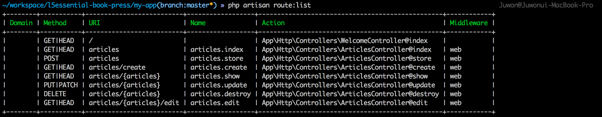
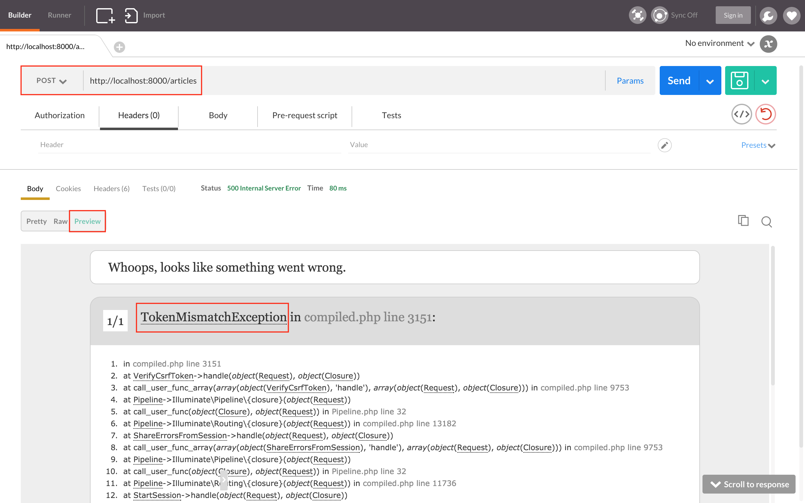
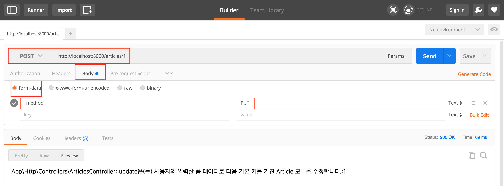

## 8장 컨트롤러

### 8.1. 컨트롤러 만들기

```php
// 코드 8-1 app/Http/routes.php

Route::get('/', 'WelcomeController@index');
```

```sh
$ php artisan make:controller WelcomeController
```

```php
// 코드 8-2 app/Http/Controllers/WelcomeController.php

<?php

namespace App\Http\Controllers;

// use ... 지금은 쓰지 않으므로 지워도 된다.

class WelcomeController extends Controller
{
    public function index()
    {
        return view('welcome');
    }
}
```

### 8.2. RESTful 라우트와 컨트롤러

#### 8.2.1. RESTful 리소스 컨트롤러 만들기

```sh
# 콘솔 8-1 컨트롤러 뼈대 코드 만들기

$ php artisan make:controller ArticlesController --resource
```

```php
// 코드 8-3 app/Http/routes.php

Route::resource('articles', 'ArticlesController');
```

#### 8.2.2. RESTful 리소스 컨트롤러 개요

```sh
# 콘솔 8-2 라우트 목록 확인

$ php artisan route:list
```



그림 8-1 RESTful 리소스 컨트롤러로 만든 라우팅 목록

HTTP 메서드|URL 경로|HTTP 메서드 오버라이드|처리할 컨트롤러|설명
---|---|---|---|---
`GET`|`articles`| |`ArticlesController@index`|`Article` 모델 컬렉션 조회
`POST`|`articles`| |`ArticlesController@store`|새 `Article` 모델 만들기
`GET`|`articles/create`| |`ArticlesController@create`|새 `Article` 모델 프로퍼티 값을 입력 받기 위한 폼
`GET`|`articles/{articles}`| |`ArticlesController@show`|`{articles}` 기본키 값을 가진 `Article` 모델 조회  
`POST`|`articles/{articles}`|`_method=PUT`|`ArticlesController@update`|`{articles}` 기본키 값을 가진 `Article` 모델의 프로퍼티 값 수정
`POST`|`articles/{articles}`|`_method=DELETE`|`ArticlesController@delete`|`{articles}` 기본키 값을 가진 `Article` 모델 삭제
`GET`|`articles/{articles}/edit`| |`ArticlesController@edit`|`{articles}` 기본키 값을 가진 `Article` 모델의 프로퍼티 수정 값을 받기 위한 폼

표 8-1 REST 원칙에 맞춘 URL과 컨트롤러 메서드

#### 8.2.3. RESTful 리소스 컨트롤러 테스트

```php
// 코드 8-4 app/Http/Controllers/ArticlesController.php

class ArticlesController extends Controller
{
    public function index()
    {
        return __METHOD__ . '은(는) Article 컬렉션을 조회합니다.';
    }

    public function create()
    {
        return __METHOD__ . '은(는) Article 컬렉션을 만들기 위한 폼을 담은 뷰를 반환합니다.';
    }

    public function store(Request $request)
    {
        return __METHOD__ . '은(는) 사용자의 입력한 폼 데이터로 새로운 Article 컬렉션을 만듭니다.';
    }

    public function show($id)
    {
        return __METHOD__ . '은(는) 다음 기본키를 가진 Article 모델을 조회합니다.:' . $id;
    }

    public function edit($id)
    {
        return __METHOD__ . '은(는) 다음 기본키를 가진 Article 모델을 수정하기 위한 폼을 담은 뷰를 반환합니다.:' . $id;
    }

    public function update(Request $request, $id)
    {
        return __METHOD__ . '은(는) 사용자의 입력한 폼 데이터로 다음 기본키를 가진 Article 모델을 수정합니다.:' . $id;
    }

    public function destroy($id)
    {
        return __METHOD__ . '은(는) 다음 기본키를 가진 Article 모델을 삭제합니다.:' . $id;
    }
}
```

#### 8.2.4. CSRF 공격 방어 기능



그림 8-2 라라벨의 CSRF 공격 방어 기능(포스트맨)

```php
// 코드 8-5 app/Http/Middleware/VerifyCsrfToken.php

class VerifyCsrfToken extends BaseVerifier
{
    protected $except = [
        'articles',
        'articles/*'
    ];
}
```

#### 8.2.5. HTTP 메서드 오버라이드



그림 8-3 HTTP 메서드 오버라이드(포스트맨)

#### 8.2.6. RESTful 라우트 보충

### 8.3. 마치며

```sh
$ git commit -m '컨트롤러'
$ git tag 1008-controller
```
