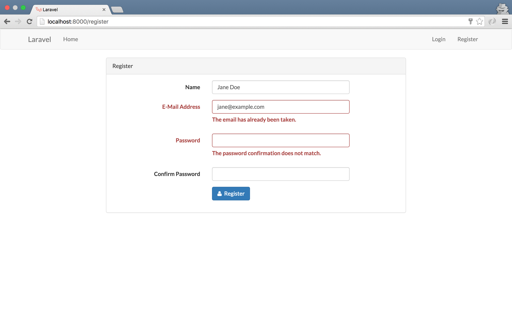

## 9장 사용자 인증

### 9.1. HTTP의 무상태 특성


그림 9-1 쿠키를 이용한 세션 유지 메커니즘

### 9.2. 기본기 다지기

#### 9.2.1. User 모델

```php
// 코드 9-1 app/User.php

protected $fillable = [
    'name', 'email', 'password',
];

protected $hidden = [
    'password', 'remember_token',
];
```

```php
// 코드 9-2 database/migrations/TIMESTAMP_create_users_table.php

Schema::create('users', function (Blueprint $table) {
    $table->increments('id');
    $table->string('name');
    $table->string('email')->unique();
    $table->string('password', 60);
    $table->rememberToken();
    $table->timestamps();
});

// ...
```

```sh
# 콘솔 9-1 새로운 사용자 만들기

>>> $user = App\User::create([
... 'name' => 'John Doe',
... 'email' => 'john@example.com',
... 'password' => bcrypt('password')
... ]);
# 출력 결과 생략
```

#### 9.2.2. 사용자 인증 구현

```php
// 코드 9-3 app/Http/routes.php

Route::get('/', 'WelcomeController@index');

Route::get('auth/login', function () {
    $credentials = [
        'email' => 'john@example.com',
        'password' => 'password'
    ];

    if (! auth()->attempt($credentials)) {
        return '로그인 정보가 정확하지 않습니다.';
    }

    return redirect('protected');
});

Route::get('protected', function () {
    dump(session()->all());
    
    if (! auth()->check()) {
        return '누구세요?';
    }

    return '어서 오세요 ' . auth()->user()->name;
});

Route::get('auth/logout', function () {
    auth()->logout();

    return '또 봐요~';
});
```


그림 9-2 크롬 개발자 도구로 본 쿠키 매커니즘 

#### 9.2.3. auth 미들웨어

```php
// 코드 9-4 app/Http/routes.php

Route::get('protected', ['middleware' => 'auth', function () {
    // if 절은 삭제한다.
}]);
```

```php
// 코드 9-5 app/Http/Middleware/Authenticate.php

class Authenticate
{
    public function handle($request, Closure $next, $guard = null)
    {
        if (Auth::guard($guard)->guest()) {
            if ($request->ajax() || $request->wantsJson()) {
                return response('Unauthorized.', 401);
            } else {
                return redirect()->guest('login');
            }
        }

        return $next($request);
    }
}
```

```php
// 코드 9-6 app/Http/Kernel.php

protected $routeMiddleware = [
    'auth' => \App\Http\Middleware\Authenticate::class,
    // ...
];
```

### 9.3. 라라벨 내장 사용자 인증

```sh
# 콘솔 9-2 라라벨 내장 사용자 인증 기능 초기화

$ php artisan make:auth
# Created View: resources/views/auth/login.blade.php
# Created View: resources/views/auth/register.blade.php
# Created View: resources/views/auth/passwords/email.blade.php
# Created View: resources/views/auth/passwords/reset.blade.php
# Created View: resources/views/auth/emails/password.blade.php
# Created View: resources/views/layouts/app.blade.php
# Created View: resources/views/home.blade.php
# Created View: resources/views/welcome.blade.php
# Installed HomeController.
# Updated Routes File.
# Authentication scaffolding generated successfully!
```



그림 9-3 라라벨에 내장 사용자 등록 화면

```sh
# 코드 9-7 .env

MAIL_DRIVER=log
```

```php
// 코드 9-8 config/mail.php

'from' => ['address' => 'john@example.com', 'name' => 'Admin'],
```
    
### 9.4. 마치며

```sh
$ git commit -m '사용자 인증'
$ git tag 1009-authentication
```
