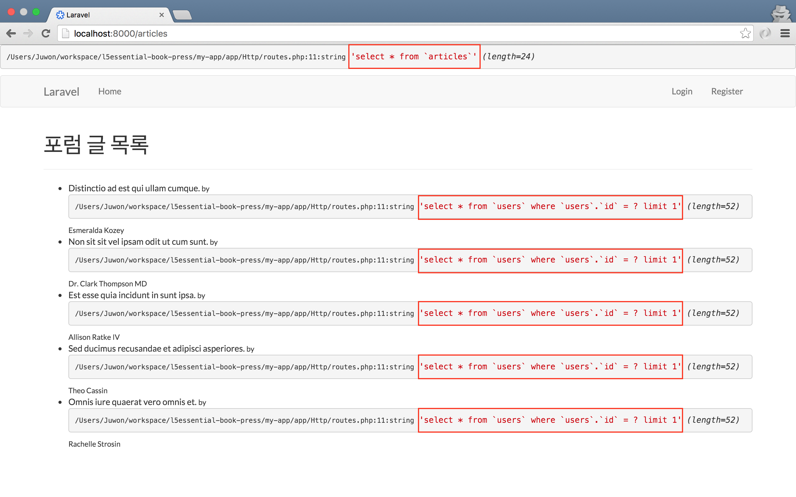
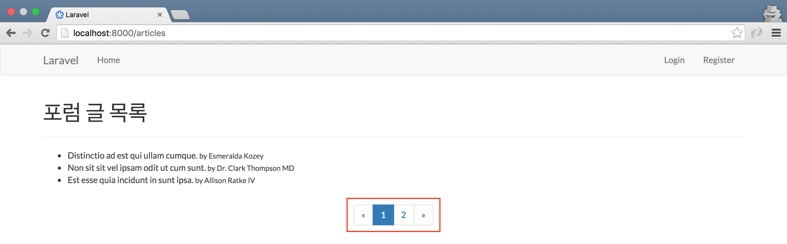

## 12장 즉시 로드와 페이징

### 12.1. 즉시 로드

```php
// 코드 12-1 app/Http/routes.php

Route::resource('articles', 'ArticlesController');
```

```php
// 코드 12-2 app/Http/Controllers/ArticlesController.php

class ArticlesController extends Controller
{
    public function index()
    {
        $articles = \App\Article::get();
        
        return view('articles.index', compact('articles'));
    }
}
```

```html
<!-- // 코드 12-3 resources/views/articles/index.blade.php -->

@extends('layouts.app')

@section('content')
  <div class="container">
    <h1>포럼 글 목록</h1>
    <hr/>
    <ul>
      @forelse($articles as $article)
        <li>
          {{ $article->title }}
          <small>
            by {{ $article->user->name }}
          </small>
        </li>
      @empty
        <p>글이 없습니다.</p>
      @endforelse
    </ul>
  </div>
@stop
```

#### 12.1.1. N+1 쿼리 문제

```php
// 코드 12-4 app/Http/routes.php

DB::listen(function ($query){
    var_dump($query->sql);
});
```



그림 12-1 N+1 문제점

#### 12.1.2. 해결 방법

```php
// 코드 12-5 app/Http/Controllers/ArticlesController.php

$articles = \App\Article::with('user')->get();
```

#### 12.1.3. 지연 로드

```php
// 코드 12-6 app/Http/Controllers/ArticlesController.php

$articles = \App\Article::get();

// user() 관계가 필요 없는 다른 로직 수행

$articles->load('user');

return view('articles.index', compact('articles'));
```

### 12.2. 페이징

#### 12.2.1. 페이지네이터

```php
// 코드 12-7 app/Http/Controllers/ArticlesController.php

$articles = \App\Article::latest()->paginate(3);

return view('articles.index', compact('articles'));
```

```html
<!-- // 코드 12-8 resources/views/articles/index.blade.php -->

@extends('layouts.app')

@section('content')
  <div><!-- //... --></div>
  
  @if($articles->count())
    <div class="text-center">
      {!! $articles->render() !!}
    </div>
  @endif
@stop
```



그림 12-2 트위터 부트스트랩이 적용된 페이지네이터

### 12.3. 마치며

```sh
$ git commit -m '즉시 로드와 페이징'
$ git tag 1012-eagerloading-pagination
```
