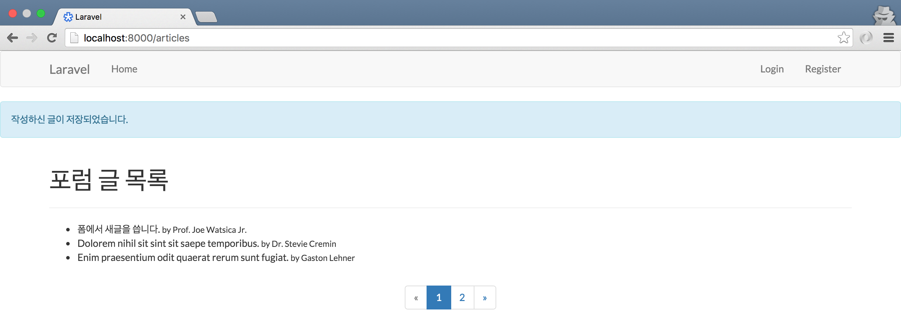

## 13장 입력 값 유효성 검사

### 13.1. 유효성 검사 기본기

```php
// 코드 13-1 app/Http/routes.php

Route::resource('articles', 'ArticlesController');
```

#### 13.1.1. 전송 폼 만들기

```php
// 코드 13-2 app/Http/Controllers/ArticlesController.php

public function create()
{
    return view('articles.create');
}
```

```html
<!-- // 코드 13-3 resources/views/articles/create.blade.php -->

@extends('layouts.app')

@section('content')
  <div class="container">
    <h1>새 포럼 글 쓰기</h1>

    <hr/>

    <form action="{{ route('articles.store') }}" method="POST">
      {!! csrf_field() !!}

      <div class="form-group {{ $errors->has('title') ? 'has-error' : '' }}">
        <label for="title">제목</label>
        <input type="text" name="title" id="title" value="{{ old('title') }}" class="form-control"/>
        {!! $errors->first('title', '<span class="form-error">:message</span>') !!}
      </div>

      <div class="form-group {{ $errors->has('content') ? 'has-error' : '' }}">
        <label for="content">본문</label>
        <textarea name="content" id="content" rows="10" class="form-control">{{ old('content') }}</textarea>
        {!! $errors->first('content', '<span class="form-error">:message</span>') !!}
      </div>

      <div class="form-group">
        <button type="submit" class="btn btn-primary">
          저장하기
        </button>
      </div>
    </form>
  </div>
@stop
```

#### 13.1.2. 컨트롤러 로직 추가

```php
// 코드 13-4 app/Http/Controllers/ArticlesController.php

class ArticlesController extends Controller
{
    public function store(Request $request)
    {
        $rules = [
            'title'   => ['required'],
            'content' => ['required', 'min:10'],
        ];

        $validator = \Validator::make($request->all(), $rules);

        if ($validator->fails()) {
            return back()->withErrors($validator)
                         ->withInput();
        }

        $article = \App\User::find(1)->articles()
                                     ->create($request->all());

        if (! $article) {
            return back()->with('flash_message', '글이 저장되지 않았습니다.')
                         ->withInput();
        }

        return redirect(route('articles.index'))
            ->with('flash_message', '작성하신 글이 저장되었습니다.');
    }
    
    // ...
}
```

#### 13.1.3. 플래시 메시지

```html
<!-- // 코드 13-5 resources/views/layouts/app.blade.php -->

  <!-- //생략 -->
</nav>

@if(session()->has('flash_message'))
  <div class="alert alert-info" role="alert">
   {{ session('flash_message') }}
  </div>
@endif

@yield('content')

<!-- //생략 -->
```



그림 13-1 플래시 메시지
     
#### 13.1.4. 오류 메시지 사용자화

```php
// 코드 13-6 config/app.php

return [
    // ...
    'locale' => 'ko',
]
```

```php
// 코드 13-7 app/Http/Controllers/ArticlesController.php

public function store(Request $request)
{
    $rules = [...];

    $messages = [
        'title.required' => '제목은 필수 입력 항목입니다.',
        'content.required' => '본문은 필수 입력 항목입니다.',
        'content.min' => '본문은 최소 :min 글자 이상이 필요합니다.',
    ];

    $validator = \Validator::make($request->all(), $rules, $messages);
    
    // ...
}
```


그림 13-2 한글로 표현된 유효성 검사 오류 표시

### 13.2. 트레이트의 메서드 이용

```php
// 코드 13-8 app/Http/Controllers/ArticlesController.php

    public function store(Request $request)
    {
        $rules = [...];
        $messages = [...];
        
        $this->validate($request, $rules, $messages);

        $article = \App\User::find(1)->articles()
                                     ->create($request->all());

        if (! $article) { ... }

        return ...
    }
```

### 13.3. 폼 리퀘스트 클래스 이용

```sh
# 콘솔 13-1 폼 리퀘스트 클래스 뼈대 코드 만들기

$ php artisan make:request ArticlesRequest
```

```php
// 코드 13-9 app/Http/Requests/ArticlesRequest.php

class ArticlesRequest extends Request
{
    public function authorize()
    {
        return true;
    }

    public function rules()
    {
        return [
            'title'   => ['required'],
            'content' => ['required', 'min:10'],
        ];
    }

    public function messages()
    {
        return [
            'required' => ':attribute은(는) 필수 입력 항목입니다.',
            'min' => ':attribute은(는) 최소 :min 글자 이상이 필요합니다.',
        ];
    }

    public function attributes()
    {
        return [
            'title' => '제목',
            'content' => '본문',
        ];
    }
}
```

```php
// 코드 13-10 app/Http/Controllers/ArticlesController.php

public function store(\App\Http\Requests\ArticlesRequest $request)
{
    $article = \App\User::find(1)->articles()
                                 ->create($request->all());

    if (! $article) {
        return back()->with('flash_message', '글이 저장되지 않았습니다.')
                     ->withInput();
    }

    return redirect(route('articles.index'))->with('flash_message', '작성하신 글이 저장되었습니다.');
}
```

### 13.4. 마치며

```
$ git commit -m '입력 값 유효성 검사'
$ git tag 1013-validation
```
