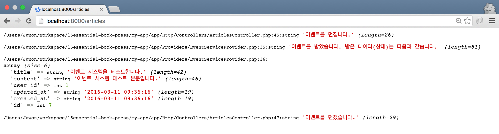

## 14장 이벤트 시스템

### 14.1. 기본기 다지기

```php
// 코드 14-1 app/Http/Controllers/ArticlesController.php

public function store(\App\Http\Requests\ArticlesRequest $request)
{
    $article = \App\User::find(1)->articles()->create($request->all());

    if (! $article) { ... }

    var_dump('이벤트를 던집니다.');
    event('article.created', [$article]);
    var_dump('이벤트를 던졌습니다.');

    // return redirect( ... );
}
```

```php
// 코드 14-2 app/Http/routes.php

Event::listen('article.created', function ($article) {
    var_dump('이벤트를 받았습니다. 받은 데이터(상태)는 다음과 같습니다.');
    var_dump($article->toArray());
});
```


 
그림 14-1 이벤트 시스템 작동 원리
 
### 14.2. 이벤트 레지스트리

```php
// 코드 14-3 app/Providers/EventServiceProvider.php

class EventServiceProvider extends ServiceProvider
{
    protected $listen = [...];

    public function boot(DispatcherContract $events)
    {
        parent::boot($events);

        $events->listen('article.created', function ($article) {
            var_dump('이벤트를 받았습니다. 받은 데이터(상태)는 다음과 같습니다.');
            var_dump($article->toArray());
        });
    }
}
```

### 14.3. 이벤트 리스너 클래스

```sh
# 콘솔 14-1 이벤트 리스너 클래스 뼈대 코드 만들기 

$ php artisan make:listener ArticlesEventListener --event=article.created
```

```php
// 코드 14-4 app/Http/Listeners/ArticlesEventListener.php

// use App\Events\article.created;

class ArticlesEventListener
{
    public function handle(\App\Article $article)
    {
        var_dump('이벤트를 받았습니다. 받은 데이터(상태)는 다음과 같습니다.');
        var_dump($article->toArray());
    }
}
```

```php
// 코드 14-5 app/Providers/EventServiceProvider.php

public function boot(DispatcherContract $events)
{
    parent::boot($events);

    $events->listen(
        'article.created', 
        \App\Listeners\ArticlesEventListener::class
    );
}
```

### 14.4. 이벤트 클래스

```sh
# 콘솔 14-2 이벤트 클래스 뼈대 코드 만들기

$ php artisan make:event ArticleCreated
```

```php
// 코드 14-6 app/Http/Events/ArticleCreated.php

class ArticleCreated extends Event
{
    use SerializesModels;

    public $article;

    public function __construct(\App\Article $article)
    {
        $this->article = $article;
    }
}
```

```php
// 코드 14-7 app/Http/Controllers/ArticlesController.php

public function store(\App\Http\Requests\ArticlesRequest $request)
{
    // ...
    dump('이벤트를 던집니다.');
    event(new \App\Events\ArticleCreated($article));
    dump('이벤트를 던졌습니다.');
}
```

```php
// 코드 14-8 app/Providers/EventServiceProvider.php

public function boot(DispatcherContract $events)
{
    parent::boot($events);

    $events->listen(
        \App\Events\ArticleCreated::class, 
        \App\Listeners\ArticlesEventListener::class
    );
}
```

```php
// 코드 14-8 app/Http/Listeners/ArticlesEventListener.php

public function handle(\App\Events\ArticleCreated $event)
{
    dump('이벤트를 받았습니다. 받은 데이터(상태)는 다음과 같습니다.');
    dump($event->article->toArray());
}
```

### 14.5. 실용적인 이벤트 시스템

```php
// 코드 14-9 app/Http/Controllers/ArticlesController.php

public function store(\App\Http\Requests\ArticlesRequest $request)
{
    $article = \App\User::find(1)->articles()->create($request->all());

    if (! $article) { ... }
    
    event(new \App\Events\ArticlesEvent($article));

    return redirect(route('articles.index'))->with('flash_message', '작성하신 글이 저장되었습니다.');
}
```

```php
// 코드 14-10 app/Providers/EventServiceProvider.php

protected $listen = [
    \App\Events\ArticlesEvent::class => [
        \App\Listeners\ArticlesEventListener::class,
    ],
];
```

```sh
# 콘솔 14-3 이벤트 채널과 리스너 뼈대 코드 한번에 만들기

$ php artisan event:generate 
```

```php
// 코드 14-11 app/Events/ArticlesEvent.php

class ArticlesEvent extends Event
{
    use SerializesModels;
    
    public $article;

    public $action;

    public function __construct(\App\Article $article, $action = 'created')
    {
        $this->article = $article;
        $this->action = $action;
    }
}
```

```php
// 코드 14-12 app/Http/Listeners/ArticlesEventListener.php

public function handle(\App\Events\ArticlesEvent $event)
{
    if ($event->action === 'created') {
        \Log::info(sprintf(
            '새로운 포럼 글이 등록되었습니다.: %s',
            $event->article->title
        ));
    }
}`
```

```sh
// 로그 14-1 storage/logs/laravel.log

[DATETIME] local.INFO: 새로운 포럼 글이 등록되었습니다.: 이벤트 시스템을 테스트합니다.
```

### 14.6. 라라벨 내장 이벤트 채널

#### 14.6.1. 마이그레이션 및 모델

```sh
# 콘솔 14-4 last_login 열 추가 마이그레이션 뼈대 코드 만들기

$ php artisan make:migration add_last_login_column_on_users_table --table=users
```

```php
// 코드 14-13 database/migrations/TIMESTAMP_add_last_login_column_on_users_table.php

class AddLastLoginColumnOnUsersTable extends Migration
{
    public function up()
    {
        Schema::table('users', function (Blueprint $table) {
            $table->timestamp('last_login')->nullable();
        });
    }

    public function down()
    {
        Schema::table('users', function (Blueprint $table) {
            $table->dropColumn('last_login');
        });
    }
}
```

```php
// 코드 14-14 app/User.php

class User extends Authenticatable
{
    protected $dates = ['last_login'];
}
```

#### 14.6.2. 이벤트 리스너

```php
// 코드 14-15 app/Providers/EventServiceProvider.php

protected $listen = [
    // ...
    \Illuminate\Auth\Events\Login::class => [
        \App\Listeners\UsersEventListener::class
    ],
];
```

```sh
# 콘솔 14-5 이벤트 채널 및 리스너 뼈대 코드 만들기

$ php artisan event:generate
```

```php
// 코드 14-16 app/Listeners/UsersEventListener.php 

class UsersEventListener
{
    public function handle(Login $event)
    {
        $event->user->last_login = \Carbon\Carbon::now();

        return $event->user->save();
    }
}
```

#### 14.6.3. 테스트

```sh
# 콘솔 14-6 이벤트 처리 결과 확인

$ php artisan tinker
>>> App\User::whereEmail('Braulio92@example.org')->first();
# => App\User {#652
#      id: 1,
#      name: "Ms. Karen Parker",
#      ...
#      last_login: "2016-03-11 08:38:57",
#    }
```

### 14.7. 마치며

```sh
$ git commit -m '이벤트 시스템'
$ git tag 1014-event
```
