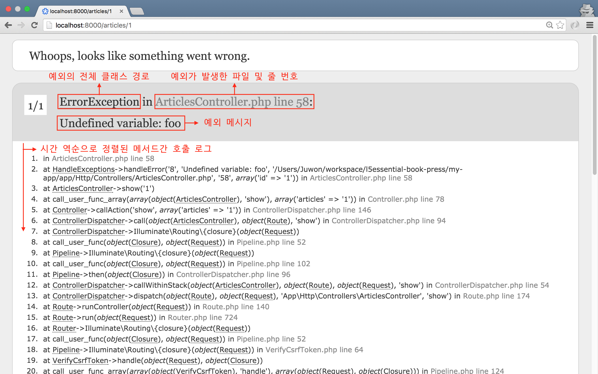
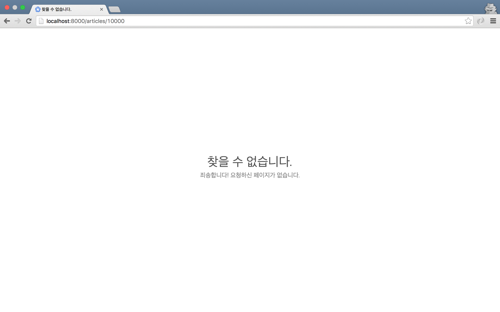

## 15장 예외 처리와 디버깅

### 15.1. 전역 예외 처리기

```php
// 코드 15-1 app/Http/Controllers/ArticlesController.php

public function show($id)
{
    echo $foo;

    return __METHOD__ . '은(는) 다음 기본키를 가진 Article 모델을 조회합니다.:' . $id;
}
```



그림 15-1 라라벨의 역추적 로그

```php
// 코드 15-2 app/Exceptions/Handler.php

class Handler extends ExceptionHandler
{
    protected $dontReport = [...];

    public function report(Exception $e)
    {
        parent::report($e);
    }

    public function render($request, Exception $e)
    {
        return parent::render($request, $e);
    }
}
```

### 15.2. 실용적인 예외 처리

```php
// 코드 15-3 app/Http/Controllers/ArticlesController.php

public function show($id)
{
    $article = \App\Article::findOrFail($id);

    return $article->toArray();
}
```

```php
// 코드 15-4 app/Exceptions/Handler.php

public function render($request, Exception $e)
{
    if (app()->environment('production')) {
        if ($e instanceof \Illuminate\Database\Eloquent\ModelNotFoundException) {
            return response(view('errors.notice', [
                'title'       => '찾을 수 없습니다.',
                'description' => '죄송합니다! 요청하신 페이지가 없습니다.'
            ]), 404);
        }
    }

    return parent::render($request, $e);
}
```

```html
<!-- // 코드 15-5 resources/views/errors/notice.blade.php -->

<!DOCTYPE html>
<html>
<head>
  <meta charset="utf-8">
  <title>{{ $title }}</title>
  <meta name="viewport" content="width=device-width, initial-scale=1, user-scalable=no">
  <style>
    * { line-height: 1.5; margin: 0; }
    html { color: #888; font-family: sans-serif; text-align: center; }
    body { left: 50%; margin: -43px 0 0 -150px; position: absolute; top: 50%; width: 300px; }
    h1 { color: #555; font-size: 2em; font-weight: 400; }
    p { line-height: 1.2; }
    @media only screen and (max-width: 400px) {
      body { margin: 10px auto; position: static; width: 95%; }
      h1 { font-size: 1.5em; }
    }
  </style>
</head>
<body>
  <h1>{{ $title }}</h1>
  <p>{{ $description }}</p>
</body>
</html>
```

```sh
# 코드 15-5 .env

APP_ENV=production
```



그림 15-2 운영 환경에서 사용자가 보게 될 오류 메시지

### 15.3. 디버깅

#### 15.3.1. 버그란?

### 15.4. 디버깅 방법

#### 15.4.1. dd() 도우미 함수

```php
// 코드 15-6 app/Http/Controllers/ArticlesController.php

public function show($id)
{
    $article = \App\Article::findOrFail($id);
    dd($article);
    return $article->toArray();
}
```

```sh
# HTTP 15-1 dd() 도우미 함수의 반환값

GET /articles/1 HTTP/1.1
Host: 호스트:포트

# Article {#183 ▼
#   #fillable: array:2 [▶]
#   # ...
#   #attributes: array:6 [▶]
#   # ...
# }
```

#### 15.4.2. 뷰 디버깅

```php
// 코드 15-7 app/Http/Controllers/ArticlesController.php

public function index()
{
    $articles = \App\Article::latest()->paginate(3);
    dd(view('articles.index', compact('articles'))->render());
    return view('articles.index', compact('articles'));
}
```

#### 15.4.3. 쿼리 디버깅

```sh
# 콘솔 15-1 toSql()

$ php artisan tinker
>>> $queryLoyalUsers = App\User::where(
...   'last_login', '>', Carbon\Carbon::now()->subMonth()
... )->toSql();
=> "select * from `users` where `last_login` > ?"
```

#### 15.4.4. 콘솔 디버깅

```sh
# 콘솔 15-2 아티즌 오류

$ php artisan migrate
# Fatal error: Call to undefined method Illuminate\Database\Schema\Blueprint::password()
```

#### 15.4.4. 외부 컴포넌트 이용

### 15.5. 마치며

```
$ git commit -m '예외 처리와 디버깅'
$ git tag 1015-exception-debugging
```
