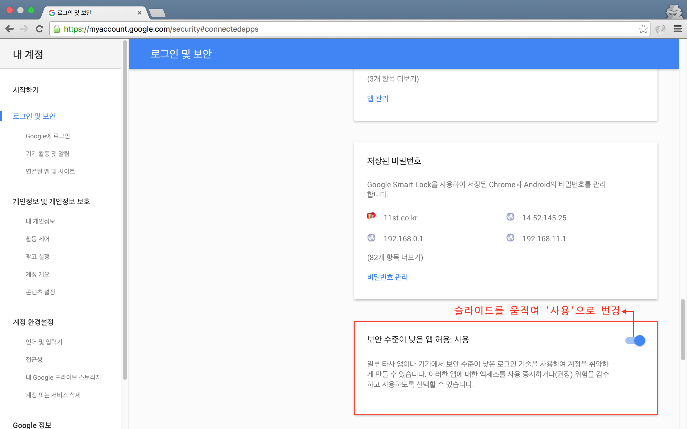
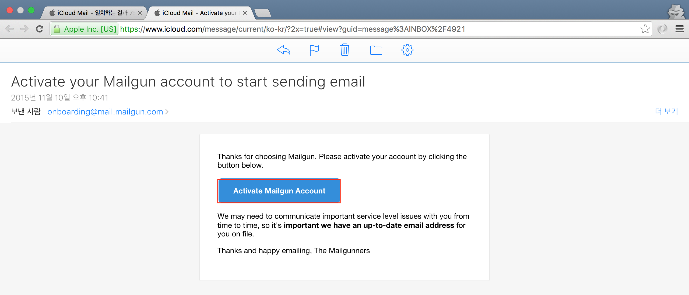
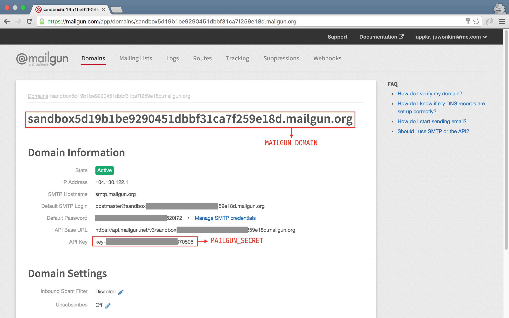
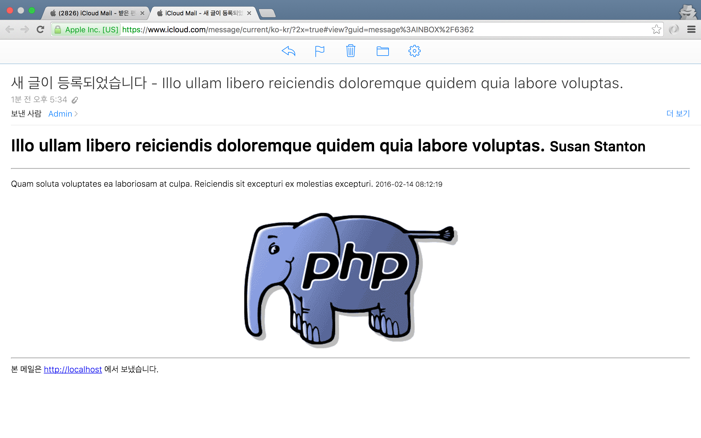

## 16장 이메일 보내기
                 
```php
// 코드 16-1 config/mail.php

'from' => ['address' => 'john@example.com', 'name' => 'Admin'],
```

### 16.1. 지메일로 메일 보내기

#### 16.1.1. 지메일 드라이버 설정

```sh
# 코드 16-2 .env

MAIL_DRIVER=smtp
MAIL_HOST=smtp.gmail.com
MAIL_USERNAME={username}@gmail.com
MAIL_PASSWORD={password}
```



그림 16-1 지메일 '로그인 및 보안 설정' 페이지

#### 16.1.2. 메일 메시지 만들기

```php
// 코드 16-3 app/Http/routes.php
    
Route::get('mail', function () {
    $article = App\Article::with('user')->find(1);

    return Mail::send(
        'emails.articles.created',
        compact('article'),
        function ($message) use ($article){
            $message->to('yours@domain');
            $message->subject('새 글이 등록되었습니다 -' . $article->title);
        }
    );
});
```

#### 16.1.3. 뷰 만들기

```html
<!-- // 코드 16-4 resources/views/articles/created.blade.php -->

<h1>
  {{ $article->title }}
  <small>{{ $article->user->name }}</small>
</h1>
<hr/>
<p>
  {{ $article->content }}
  <small>{{ $article->created_at }}</small>
</p>
<hr/>
<footer>
  본 메일은 {{ config('app.url') }} 에서 보냈습니다.
</footer>
```

#### 16.1.4. 테스트
 
### 16.2. 메일건으로 메일 보내기

```sh
# 콘솔 16-1 HTTP 클라이언트 컴포넌트 설치

$ composer require "guzzlehttp/guzzle:~5.3|~6.0"
$ composer require "symfony/psr-http-message-bridge:~0.2"
```



그림 16-2 메일건 가입 확인 메일

#### 16.2.1. 메일건 드라이버 설정

```sh
# 코드 16-5 .env

MAIL_DRIVER=mailgun
MAILGUN_DOMAIN={sandbox_RANDOM_NUMBER}.mailgun.org
MAILGUN_SECRET={key-RANDOM_NUMBER}
```



그림 16-3 메일건 드라이버 설정에 필요한 값 취득

#### 16.2.2. 테스트

```javascript
# HTTP 16-1 메일건의 응답 

{
  id: "<67f01637f5bcee622e34eeb8f4b829f8@localhost>",
  message: "Queued. Thank you."
}
```

### 16.3. 심화 학습

#### 16.3.1. 복잡한 메시지 만들기

```php
// 코드 16-6 app/Http/routes.php

return Mail::send(
    'emails.articles.created',
    compact('article'),
    function ($message) use ($article){
        $message->from('yours1@domain', 'Your Name');
        $message->to(['yours2@domain', 'yours3@domain']);
        $message->subject('새 글이 등록되었습니다 -' . $article->title);
        $message->cc('yours4@domain');
        $message->attach(storage_path('elephant.png'));
    }
);
```

#### 16.3.2. 텍스트 메일

```php
// 코드 16-7 app/Http/routes.php

return Mail::send(
    ['text' => 'emails.articles.created-text'],
    compact('article'),
    function ($message) use ($article){
        $message->to('yours@domain.com');
        $message->subject('새 글이 등록되었습니다 -' . $article->title);
    }
);
```

```html
<!-- // 코드 16-8 resources/views/emails/articles/created-text.blade.php -->

{{ $article->user->name }}님이 새 글을 등록했습니다.
---
{{ $article->content }}
{{ $article->created_at }}에 작성됨
---
본 메일은 {{ config('app.url') }} 에서 보냈습니다.
```

#### 16.3.3. 이메일 본문에 이미지 추가

```html
<!--// 코드 16-9 resources/views/emails/articles/created-text.blade.php -->

<p>
  {{ $article->content }}
  <small>{{ $article->created_at }}</small>
  <br/>
  <br/>
  <div style="text-align: center;">
    embed(storage_path('elephant.png')) }}" alt="">
  </div>
</p>
```



그림 16-4 이미지가 추가된 이메일 본문

### 16.4. 테스트 환경

```php
// 코드 16-10 config/mail.php

return [
    // ...

    'to' => [
        'address' => 'yours@domain',
        'name' => 'Tester',
    ],
];
```

### 16.5. 마치며

```sh
$ git commit -m '이메일 보내기'
$ git tag 1016-email
```
