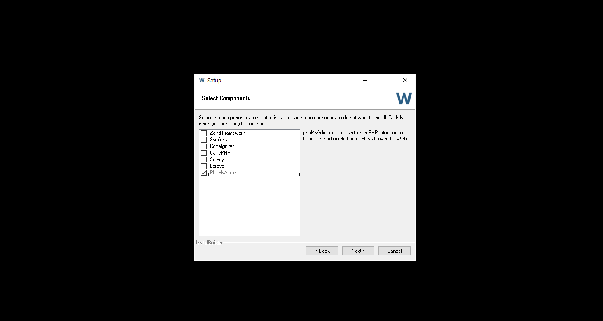
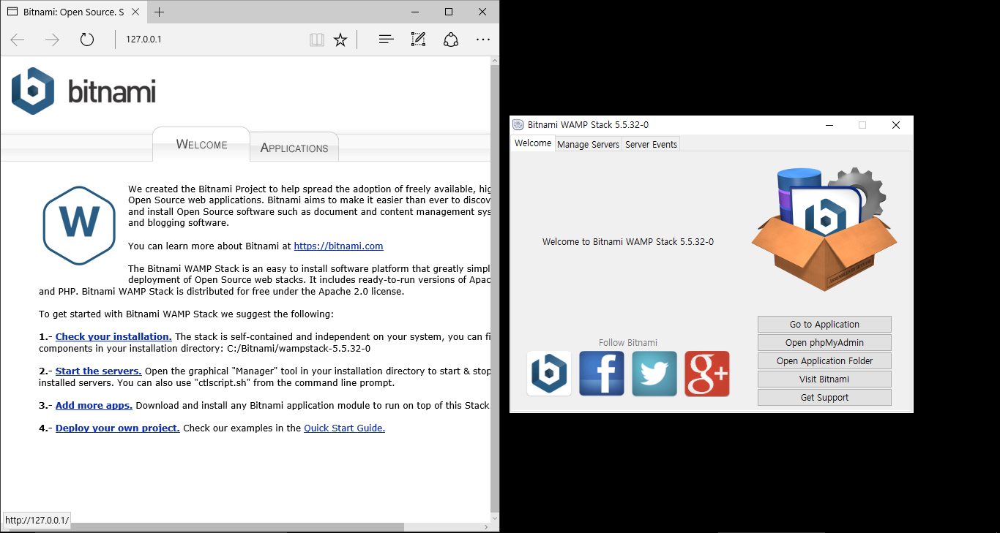
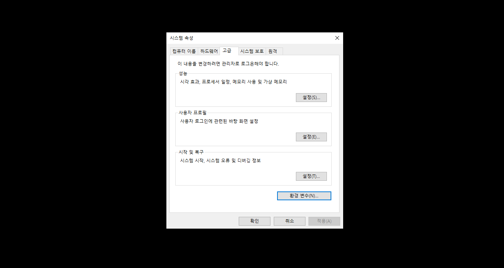
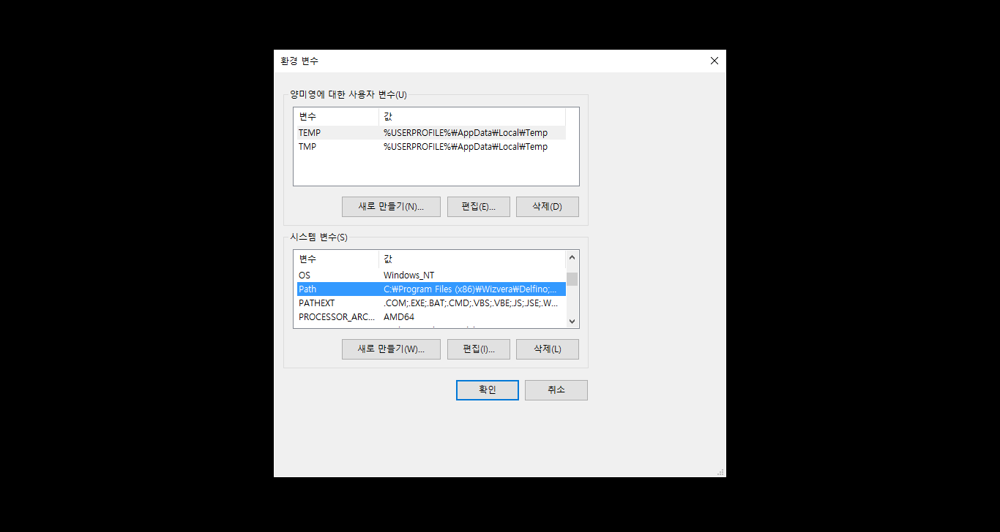
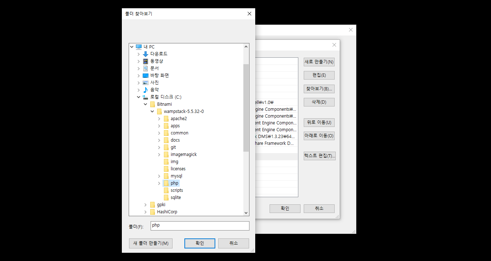

## A.4. Windows

Windows PC에 개발 환경을 준비해 보자. 라라벨이 동작하는데 문제가 없다면 이 책에서 제시하는 것과 다른 도구, 다른 버전을 사용해도 무방하다. 

### A.4.1. 개발도구 설치

아래 과정을 따라 하기 전에 먼저 본인이 사용하는 Windows 사용자 계정을 확인하자. <kbd>Windows</kbd>키와 <kbd>r</kbd>키를 동시에 누르고, 입력 박스에 `cmd`를 입력하고 <kbd>Enter</kbd>를 치면 명령 프롬프트를 열 수 있다.

```sh
# 콘솔 a-15 사용자 계정 이름 확인

$ echo $USER

# 또는
\> echo %USERNAME%
```

문제가 있다면 공백이 없는 영문 사용자 계정을 새로 만든다. 앞으로 실습은 새로 만든 계정으로 로그인해서 해야 한다. 라라벨과는 관련이 없는 문제다. 개발도구를 설치할 때나 콘솔을 사용할 때, 이런 사용자의 컴퓨터에서 문제가 발생하는 것을 오프라인 강의에서 종종 경험했다.  

```
홍길동 (x) 
Gildong Hong (x)
GildongHong (o)
gildonghong (o)
```

#### 깃배시

Windows에 기본으로 포함된 명령프롬프트를 대체하는 깃배시[^5]를 설치하자. 이하 '콘솔' 이라 부르고, 콘솔 a-15에서 썼던 Windows 내장 명령 프롬프트는 이 책에서는 사용하지 않는 것으로 가정한다.

#### 비트나미

Windows에서도 다른 운영체제처럼 PHP와 MySQL을 각각 설치할 수 있다. 그런데 PHP 확장모듈을 설치하는 방법이 복잡해서, 우리는 이미 차려진 밥상인 비트나미(bitnami)[^6]를 이용한다. 

설치 중에 Windows 방화벽과 관련된 경고가 뜬다면 무시하고 '다음' 을 누른다.

내려 받은 비트나미 파일을 더블 클릭한다. 인스톨러 화면이 열리면 '다음' 을 계속 눌러서 설치할 수 있는데, 'Select Component' 창에서는 모든 선택 상자를 해제하고 '다음'으로 진행한다.



그림 a-1 비트나미, 'Select Component' 창

설치 중에 MySQL 'root' 사용자의 비밀번호를 입력하는 창이 나타나면 'secret' 를 입력하자(이 비밀번호의 쓰임새를 알고 잘 기억할 수 있다면, 다른 비밀번호를 넣어도 좋다). 설치가 끝나면 그림 a-2의 왼쪽에 위치한 화면을 볼 수 있다. 브라우저 창은 닫고, 'Bitnami WAMP Stack 5.5.32.0' 이라 표시된 창은 그대로 둔다.



그림 a-2 비트나미, 설치 완료

이 책은 PHP 내장 웹 서버를 사용하여 실습 코드를 실행하는 방법을 설명한다. 이 책을 따라 할 독자는 그림 a-3을 참고해서 아파치(apache) 웹 서버를 끈다. 'Bitnami WAMP Stack 5.5.32.0'으로 표시된 창에서 'Manage Servers' 탭을 누른다. 현재 실행 중인 서버 목록이 표시된다. 'Apache Web Server' 항목을 선택한 후 'Stop' 버튼을 눌러 끈다.


그림 a-3 비트나미, 스택 매니저에서 아파치 웹 서버 끄기

`php` 와 `mysql` 명령을 어떤 경로에서든 실행할 수 있도록 운영체제 설정을 변경해야 한다. 작업표시줄의 '웹 및 Windows 검색' 에서 '시스템 환경 변수 편집'을 타이핑하고 <kbd>Enter</kbd>를 누른다. 검색 결과에서 '시스템 환경 변수 편집(제어판)'을 선택하면 그림 a-4와 같은 창이 나타난다.



그림 a-4 Windows, 시스템 환경 변수 편집

창 아래에 '환경 변수(N)...'라 표시된 버튼을 눌러 '시스템 변수(S)'그룹에서 'Path' 변수를 더블 클릭하면 새로운 창이 나타난다.



그림 a-5 Windows, 시스템 환경 변수 편집

새로 나타난 창에서 '찾아보기(B)...'를 눌러 아래 두 개의 경로를 추가한다. 독자 여러분이 설치할 때는 그림과 다른 버전이 다른 경로에 설치되었을 것이다. 자신이 설치한 경로에 찾아서 적용한다.

- `C:\Bitnami\wampstack-5.5.32-0\php`
- `C:\Bitnami\wampstack-5.5.32-0\mysql\bin`



그림 a-6 Windows, 시스템 환경 변수 편집에서 PHP 및 MySQL 경로 추가

#### 비트나미 설치 확인

PHP와 MySQL이 잘 설치되었나 콘솔에서 확인하자. 앞 절에서 추가한 경로 설정이 적용되지 않아 `php`, `mysql` 명령이 동작하지 않는다면 콘솔에서 `set` 명령어를 한번 실행해 준다. 그래도 안되면, 운영체제를 재 부팅한다.

```sh
# 콘솔 a-16 PHP 버전 확인

$ php --version
# PHP 5.6.18 (cli) (built: ...)
```

[편주 - 박스 겹침 방지]

```sh
# 콘솔 a-17 MySQL 버전 확인

$ mysql --version
# C:\Bitnami\wampstack-5.5.32-0\mysql\bin\mysql.exe VER 14.14 Distrib 5.6.28, for Win32
```

#### PHP 설정 변경

비트나미는 운영[^5] 환경에 사용할 것을 염두에 둔 패키지다. 개발에 적합하도록 PHP의 설정을 변경하자. 콘솔에서 PHP의 설정 파일의 위치를 찾는다.

```sh
# 콘솔 a-18 PHP 환경 설정 파일 찾기

$ php --ini
# Configuration File (php.ini) Path: C:\WINDOWS
# Loaded Configuration File:         C:\Bitnami\wampstack-5.5.32\php\php.ini
```

`C:\Bitnami\wampstack-5.5.32\php\php.ini`에 위치한 설정 파일을 메모장으로 연다. 

```sh
# 콘솔 a-19 PHP 환경 설정 파일 열기

$ notepad C:\Bitnami\wampstack-5.5.32\php\php.ini
```

찾아서 수정해야 할 곳은 두 군데이다.

- `opcache.enable=1` (기존) -> `opcache.enable=0` (변경)
- `display_errors=Off` (기존) -> `display_errors=On` (변경)


그림 a-7 메모장, PHP 설정 변경

#### 컴포저

Windows용 컴포저 인스톨러[^7]를 내려 받아 설치한다. 설치 중에 PHP 경로를 물어보는데 `C:\Bitnami\wampstack-5.5.32\php\php.exe`를 찾아서 선택한다. 컴포저는 PHP의 표준 의존성 관리 도구다.

```sh
# 콘솔 a-20 컴포저 설치 및 확인

$ composer --version 
# Composer version 1.0.0 ...
```

### A.4.2. PHP 확장모듈

이 책을 따라 했다면 필요한 확장모듈은 이미 준비된 상태다. 아래 명령으로 한 번 더 확인하자. `openssl`, `pdo_mysql`, `mbstring`, `tokenizer` 총 네 개의 확장모듈 이름이 출력결과에 있는 지 확인한다. 빠진 확장모듈이 있다면 구글링해서 설치한다.

```sh
# 콘솔 a-21 PHP 확장모듈 확인

$ php -m
```

[^5]: 깃배시(Git sh)_ https://git-for-windows.github.io 책을 쓰는 도중에 마이크로소프트가 Windows 10에 배시 쉘을 포함한다고 발표했다. Windows 10 사용자는 깃배시를 설치하기전에 운영체제에 배시 쉘 포함여부를 꼭 확인하라.  

[^6]: 비트나미(Bitnami)_ https://bitnami.com/stack/wamp

[^7]: Windows용 컴포저 인스톨러_ https://getcomposer.org/Composer-Setup.exe