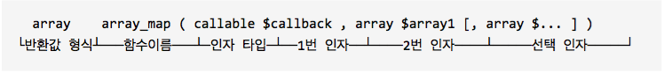

# 부록 B 속성 PHP 프로그래밍 입문

부록 B는 임베디드, 모바일 앱 등의 다른 분야에서 활동하다가 PHP 언어로 웹 개발을 시작하려는 독자 및 PHP 언어로 웹 개발에 처음 입문하려는 독자를 대상으로 한다. 이 분들이 이 책의 본문을 소화하기 위해 필요한 기초적인 PHP 문법을 소개한다.

이미 PHP는 잘 아는데, 이제 라라벨을 배우려는 독자는 이 부록을 읽을 필요 없다.

## B.1. PHP 스크립트의 작동 원리

코드 에디터를 펼치고 다음 코드를 입력한다.

```php
// 코드 b-1 index.php

<html>
  <body>
    <h1>Hello World!</h1>
  </body>
</html>
```

콘솔 b-1처럼 로컬 서버를 구동한다. 브라우저를 열고 `http://localhost:8000` 주소로 접속한다. 

```sh
# 콘솔 b-1 로컬 서버 구동

$ php -S localhost:8000
```

코드 b-1은 이상하다. 확장자는 `.php`인데 PHP 문장은 한 줄도 볼 수 없다. 그리고, 브라우저에서는 HTML 코드가 정상으로 출력된다. 그럼 이번엔 코드 b-2를 실험해 보자.

```php
// 코드 b-2 index.php

<html>
  <body>
    <h1><?php echo 'Hello World!' ?></h1>
  </body>
</html>
```

코드 b-2는 HTML 중간에 PHP의 문자열 보간(string interpolation, `<?php echo '...'; ?>`) 구문이 들어 있다. `<?= '...' ?>`처럼 짧게 쓸 수도 있다. `echo`는 숫자, 문자, 불리언 값을 출력하는 문법이다. 어쨌든 웹 브라우저에는 코드 b-1과 똑같은 화면이 표시된다. 

우리는 방금 PHP 언어의 가장 큰 특징을 봤다. PHP 태그로 싸진 부분만 PHP가 처리한다. PHP 블록의 처리 결과를 HTML 코드에 끼워 넣고, PHP가 아닌 나머지는 그대로 출력한다는 특징 말이다. 

초기 웹 역사에 PHP의 출현은 큰 의미를 가진다. 초기 동적 웹 페이지는 C 또는 Perl로 짰다. C 언어는 `printf("<html>\n");`처럼 HTML 코드를 한 줄씩 출력해야만 했다. Perl 언어 `print <<EOT <html>...</html>EOT`처럼 HEREDOC 문법을 쓸 수 있었지만 편리하지는 않았다. 

그때 PHP의 출현은 혁명과도 같은 일이었다. 닷컴 열기와 함께 인터넷 호스팅 업체들이 너도 나도 LAMP 스택을 도입했고, 덩달아 PHP는 또 한번의 부흥기를 맞았다. 쉬운 개발, 풍부한 개발 인력, 값싼 호스팅 등, PHP가 인기를 얻은 이유다.

부록 B에서 우리의 관심사는 `<?php ... ?>` 태그에 둘러 싸인 부분이다. HTML은 다루지 않으므로 브라우저보다는 PHP가 제공하는 REPL을 이용한다.

모르는 용어는 그냥 넘어가자. 책 본문에 다룬다.

## B.2. PHP 언어 기본

PHP 언어로 작성된 코드를 'PHP 스크립트'라고 한다. 앞서 봤듯이 하나의 PHP 스크립트에는 PHP와 PHP가 아닌 문장들이 뒤섞여 있다. PHP 인터프리터는 PHP 스크립트의 여는 태그(`<?php`)와 닫는 태그(`?>`)로 자신이 할 일과 하지 않을 일을 구분한다.

코드 b-2에서 또 하나 눈에 띄는 것은 따옴표다. PHP에서 문자열은 따옴표로 감싸는데, 홑따옴표(`'`), 쌍따옴표(`"`) 모두 쓸 수 있다. 그리고 세미콜론(`;`)은 문장의 끝을 알리는 마침표다. 빼 먹으면 오류가 발생하니 주의해야 한다. 

## B.3. 변수와 상수

변수는 변하는 값, 상수는 변하지 않는 값이다. PHP에서 변수는 달러(`$`)기호로 시작하고, 공백 없이 바로 뒤에 이름을 붙인다. 변수를 만들어 보자. 콘솔 b-2에서 `$foo`는 변하는 값이므로 `$foo`의 현재 값은 `bar`가 아니라 `baz`인 것에 주목하라.

```sh
# 콘솔 b-2 변수

$ php -a           # 이하 PHP REPL을 실행하는 콘솔 명령은 생략한다.
php > $foo = 'bar';
php > $foo = 'baz';
php > echo $foo;
# baz
```

상수를 만들어 보자. 상수는 `const` 키워드로 정의한다. 상수의 이름은 관례상 전부 대문자를 쓰고, 단어를 조합할 때는 밑줄(`FOO_BEAR`)을 사용한다. 변수는 선언하고 나중에 값을 할당할 수 있지만, 상수는 선언할 때만 값을 할당할 수 있다. 그리고, 할당된 값은 다른 값으로 바꿀 수 없다. 콘솔 b-3에서 `FOO` 상수의 값을 `baz`로 바꾸려고 하면 오류가 난다. `FOO` 상수의 값을 출력하면 처음 선언된 값이 변하지 않았음을 알 수 있다.  

```sh
# 콘솔 b-3 상수

php > const FOO = 'bar';
php > FOO = 'baz';
# PHP Parse error:  syntax error, unexpected '=' in php shell code on line 1
# Parse error: syntax error, unexpected '=' in php shell code on line 1
php > echo FOO;
# bar
```

실무 프로그래밍에서는 변수와 상수를 엄격히 구분하여 사용하지 않고, 보통은 상수도 변수로 쓴다. 그나저나 변수나 상수는 왜 필요할까?

```sh
# 콘솔 b-4 변수와 상수의 유용성, 사용법

php > $name = 'foo';
php > echo 'Hello $name. $name, you have 10 unread messages';
# Hello $name. $name, you have 10 unread messages
php > echo "Hello $name. $name, you have 10 unread messages";
# Hello foo. foo, you have 10 unread messages
```

우선, `$name`이 두 번 나온다. `foo`를 천 번 써야 한다 가정해 보자. 전체 코드에서 `foo`를 다른 이름으로 바꿔야 한다면 악몽일 것이다. 

워드프로세서에서 메일 머지라는 기능을 써봤는지 모르겠다. 수 천명의 회원에게 전부 같은 내용의 이메일을 보내는데, 'OO님 안녕하세요?'라는 문장에서 OO대신 회원이름을 넣는 기능 말이다. 수 천번의 복사-붙여넣기를 하지 않아도 된다. 메일 머지는 변수와 반복문의 가장 기본적인 응용이다.
  
콘솔 b-4에서 또 하나 주목할 것은 홑따옴표와 쌍따옴표의 차이다. 쌍따옴표만 문자열 끼워 넣기를 할 수 있다. 그런데, 이 용법은 모범 사례는 아니다. 콘솔 b-5가 올바른 문법이다.

```sh
# 콘솔 b-5

php > echo 'Hello '.$name.'. '.$name.', you have 10 unread messages';
# Hello foo. foo, you have 10 unread messages
php > echo "Hello {$name}. {$name}, you have 10 unread messages";
# Hello foo. foo, you have 10 unread messages
```

먼저 따옴표 밖에 있는 점(`.`)은 PHP의 문자열 결합연산자라고 말해 둔다. `'foo'.'bar'`는 `'foobar'`가 된다. 

그런데 첫 번째 문장을 한번에 이해할 수 있겠는가? 쓰기도 힘들다. 그래서 쌍따옴표를 쓴다. 쌍따옴표 안의 문자열에 변수의 값을 끼워 넣을 때는 변수명을 중괄호(`{}`)로 감싸는 것이 좋다. 중괄호는 `"$nameyou can.."`처럼 인접 문자 열과 변수가 구분되지 않을 때를 위해서다.

## B.4. 연산자

이 책에서 쓰는 연산자만 간략히 살펴본다.

### 대입연산자

가장 많이 쓰는 연산자는 대입연산자(`=`)다. 오른쪽의 값을 왼쪽에 할당할 때 사용한다. B.3절에 이미 사용했으므로 예제는 생략한다. 복합 대입연산자를 쓰면 편리할 때가 많다. 예제의 `.=`뿐만 아니라 `+=` 등 모든 사칙 연산이 가능하다.

```sh
# 콘솔 b-6

php > $foo = 'bar';
php > $foo .= 'baz';
php > echo $foo;
# barbaz
```

`++`, `--` 연산자도 자주 쓴다. `++$foo`와 `$foo++`는 다르다는 점에 주의한다. 연산자를 쓰기전에 `$foo = 1;`이라면, 연산자 적용한 후에 전자는 2, 후자는 1이다. 후자는 다음 번에 `$foo`를 참조할 때 2가 된다.  

### 산술연산자

수학에서 흔히 쓰는 더하기, 빼기, 곱하기, 나누기 등을 말한다(`+`, `-`, `*`, `/`). 

하나 알아둘 것은 PHP는 동적 타입(dynamic typing, weak typing)을 지원하는 언어라는 사실이다. 다음 예를 보면, 정수 1과 문자열 "2"를 더하는데 결과는 정수 3이다. 런타임에 문자열 "2"는 정수 2로 자동(동적)으로 변환된다.

```sh
# 콘솔 b-7

php > echo 1 + "2";
# 3
```

### 문자열연산자

문자열 결합연산자(`.`)는 콘솔 b-5에서 이미 봤으므로 생략한다.

### 비교연산자

대등(`==`), 부등(`!=`), 일치(`===`), 불일치(`===`), 큼(`>`, `>=`), 작음(`<`, `<=`)등이 있다. 비교연산자는 주로 조건문에 사용한다. 

PHP 개발에서 가장 어려운 부분 중에 하나가 대등과 일치 연산자를 구분해서 사용해야 할 때다. 다음 예를 보자.

```sh
# 콘솔 b-8

php > var_dump(0 == false);
# bool(true)
php > var_dump(null == false);
# bool(true)
```

`var_dump($var)`는 인자로 받은 `$var` 값을 출력하는 PHP 내장 함수다. 불리언, 배열, 객체는 `echo`로 출력할 수 없어 이 함수를 사용한다. `0`, `null`, `false`를 엄격히 구분해야 할 때는 반드시 일치 또는 불일치 연산자를 사용해야 한다.

### 논리연산자

`&&`, `||`로 표현할 수도 있는데, 우리 책에서는 읽기 편한 `and`, `or`를 주로 사용한다. 엄격히 따지면 연산 우선순위가 다르지만, 우선순위는 괄호로 묶으면 모두 해결되기 때문에 별 의미가 없다. 연산자가 함축하고 있는 우선순위에 의존한 코드보다는 사람이 이해하기 편한 괄호가 더 나은 코드다.

## B.5. 데이터 타입

PHP에서 사용하는 데이터 타입은 정수, 실수, 문자열, 불리언, 배열, 객체 등이 있다. 나머지는 이미 봤으므로, 배열과 객체만 살펴보자.

### 배열

PHP의 배열은 대괄호(`[]`)로 정의한다. 배열의 원소에 접근할 때는 0부터 시작하는 인덱스(index) 번호를 이용한다. 

자세히 보면 배열에는 두 개의 원소가 있고, `var_dump()` 함수가 0번은 3바이트 문자열 'bar', 1번은 3바이트 문자열 'baz'라고 자세한 정보를 알려준다.   

```sh
# 콘솔 b-9

php > $foo = ['bar', 'baz'];
php > echo $foo[0];
# bar
php > var_dump($foo);
# array(2) {
#   [0] =>
#   string(3) "bar"
#   [1] =>
#   string(3) "baz"
# }
```

PHP에는 키-값 쌍으로 표현하는 또 다른 배열, 연관 배열(associative array)이 있다. 다른 언어에서는 해시, 딕셔너리라고 부르기도 한다. 연관 배열은 인덱스 번호 대신, 키 이름으로 값을 조회할 수 있다. 키-값 간의 쌍 연결은 이중 화살표(`=>`)를 이용한다.

```sh
# 콘솔 b-10

php > $foo = ['foo' => 'bar', 'baz' => 'qux'];
php > echo $foo['baz'];
# qux
php > var_dump($foo);
# array(2) {
#   'foo' =>
#   string(3) "bar"
#   'baz' =>
#   string(3) "qux"
# }
```

배열 및 연관 배열에는 정수, 문자열, 또 다른 배열, 객체 등 담을 수 있는 값에 제한이 없다.   

### 객체

부록 C에서 좀더 자세히 다룬다. 콘솔 b-11의 `stdClass`는 PHP에 내장된 깡통 클래스다. 새로운 객체를 만들 때는 `new` 키워드를 사용한다. 배열처럼 하나 이상의 값을 담을 수 있다는 점에서 비슷하지만, 사실은 완전히 다른 데이터 구조다. 객체의 프로퍼티는 화살표(`->`)로 접근할 수 있다.

```sh
# 콘솔 b-11

php > $foo = new stdClass;
php > $foo->property = 'bar';
php > var_dump($foo);
# class stdClass#1 (1) {
#   public $property =>
#   string(3) "bar"
# }
```

### 타입 변환

PHP의 변수는 동적 타입을 가지지만, 명시적으로 변환해야 할 때가 있다. 이럴 때는 변수 또는 값 앞에 `(int)`, `(array)`, `(object)` 등의 키워드를 쓰면 된다. 이번 예제에서는 콘솔 b-11에서 만든 `$foo` 객체를 그대로 사용한다.

```sh
# 콘솔 b-12

php > var_dump((array) $foo);
# array(1) {
#   'property' =>
#   string(3) "bar"
# }
```

## B.6. 조건문

조건문은 상황에 따라 처리 로직을 분리할 때 사용한다. 다른 문법도 있지만, `if(조건식) {...} elseif (조건식) {...} else {...}`를 가장 많이 쓴다.

### if

콘솔 b-13에서 `if`절의 조건식이 참이므로 해당 문자열을 출력했다. 거짓이면 `else`절을 탄다.  

```sh
# 콘솔 b-13

php > if (true) {
php   echo 'The expression was evaluated as "true"';
php   } else {
php   echo 'The expression was evaluated as "false"';
php   }
# The expression was evaluated as "true"
```

모든 절은 평가 대상이 되는 조건식이 참일 때만 실행된다. `if`절을 통과하면 첫 번째 `elseif`, `elseif`를 통과하면 그 다음 `elseif`, 어떤 조건도 참이 아니면 `else` 절의 본문을 실행한다. 

`else`가 없이 `if`만 있을 때는, `if`절을 실행하고, `if`절 밖에 있는 그 다음 로직을 순차적으로 실행한다. `if`절 안에서 `exit()`, `die()`, `throw`, `return` 등으로 로직의 실행을 끝내면 다음 로직으로 넘어가지 않는다.  

`else if`로 써도 동작한다. 그러나 쓰지 말라. PSR-2 표준 권고안은 `elsif`다.

### 일항 논리연산자

이 책에서는 일항 연산자를 많이 쓴다. 콘솔 b-14에서 `$foo`값이 `null`이므로 `if`절은 일항 부정연산자(`!`)때문에 참으로 평가된다. PHP에서는 `null`, `0`, `''` 등은 모두 거짓으로 평가한다. 앞서 말했다시피, 오류를 피하기 위해서는 일치 연산자(`===`)를 사용하는 것이 좋다. 우리 예제에서는 `$foo` 변수의 값을 확실히 예측할 수 있다면, `is_null()` PHP 함수를 사용하는 것도 괜찮다.

```sh
# 콘솔 b-14

php > $foo = null;
php > if (! $foo) {
php   echo '$foo has no value';
php   }
# $foo has no value
```

PHP는 조건식 자리에서 연산을 하고, 연산 결과를 변수에 대입하는 것이 가능하다. 콘솔 b-15는 `if`절의 표현식 안에서 `$foo * $bar`를 계산하고, `$baz` 변수에 대입한 것이다.

```sh
# 콘솔 b-15

php > $foo = $bar = 100;
php > if ($baz = $foo * $bar) {
php   echo '$baz has value of '.$baz;
php   }
# $baz has value of 10000
```

### 삼항연산자

삼항연산자(`?:`)는 `조건식 ? 참일_때_실행할_로직 : 거짓일_때_실행할_로직;`처럼 쓴다. `if-else`를 짧게 쓴 것이다. 

콘솔 b-16은 `$foo` 변수에 값이 있는지를 검사한 후, 값이 있으면 `$foo` 값을 반환하고, 없으면 'qux'를 반환한다. 그리고 반환값을 `$baz` 변수에 대입했다. 잘 이해되지 않는다면, 패턴으로 외우자. 굉장히 자주 쓰는 구문이다.

```sh
# 콘솔 b-16

php > $foo = 'bar';
php > $baz = $foo ?: 'qux';
php > echo $baz;
# bar
```

## B.7. 반복문

반복문의 가장 큰 존재 이유는 중복의 제거(DRY, Don't Repeat Yourself)다. 1부터 100까지 숫자를 출력할 때 `echo` 100번을 쓰는 것보다 반복문을 쓰는 것이 효율적이다. 그뿐만 아니라, 반복문을 조작해서 마지막 숫자를 10,000으로 변경하거나, 10의 배수만 출력하기에도 편리하다.

우리 책에서는 `for`, `while`등은 잘 쓰지 않고 거의 `foreach`만 쓴다. `foreach`는 배열을 순회할 때 편리하다. `foreach(배열 as 원소) { 반복_실행할_코드; }` 형식으로 쓴다.

```sh
# 콘솔 b-17

php > $collection = ['apple', 'banana', 'tomato'];
php > foreach($collection as $fruit) {
php   echo "<li>{$fruit}</li>";
php   }
# <li>apple</li><li>banana</li><li>tomato</li>
```

연관 배열의 키를 사용할 때는 `foreach(배열 as 키_변수 => 값_변수) { 반복_실행할_코드; }`처럼 쓴다. 키 변수와 값 변수의 이름은 자유롭게 정해도 된다.

```sh
# 콘솔 b-18

php > $collection = ['apple' => 'apple.png', 'banana' => 'banana.png', 'tomato' => 'tomato.png'];
php > foreach($collection as $alt => $src) {
php   echo "";
php   }
# 
```

## B.8. 함수

코드를 한 번만 쓰고, 여러 곳에서 재사용하기 위해 함수를 쓴다.

또 복잡성을 감출 때도 사용한다. 함수는 받은 입력을 처리하고, 함수 내부에서 처리한 결과를 함수 밖으로 뱉어낸다. 함수의 소비자는 내부에서 어떤 일을 하는지 알 필요가 없다. 그건 마치 자동차 내부의 작동 원리를 몰라도, 자동차를 움직일 수 있는 것과 같은 이치다.

그런데 자동차 정비공이 자동차를 내부를 이해하고 수리나 튜닝을 하듯이, 소프트웨어의 생산자는 함수를 직접 만들어야 하고, 남이 짠 함수의 내부를 고쳐야 할 때도 있다.

사실 우리 모두는 함수를 알고 있다. 수학시간에 배웠다. `y = 2x + 1`을 PHP 함수로 표현하고 사용해 보자.

```sh
# 콘솔 b-19

php > function equation_of_line($var)
php > {
php   return 2 * $var + 1;
php   }
php > echo equation_of_line(1);
# 3
```

`function` 키워드와 이름으로 함수를 정의한다. 이어서 괄호에 인자(입력 값)을 받는다. 중괄호 안에는 처리 로직을 쓰고, `return` 키워드로 처리 결과를 반환한다.

함수와 인자의 이름을 짓는데 제약은 없다. 함수형 프로그래밍에서는 스네이크 표기법을 쓰는 것이 일반적이다. 함수이름과 괄호는 공백 없이 붙여 쓰고, 중괄호는 함수 선언 다음 줄에 쓰는 것이 PSR-2 권고사항이다.

`$var` 인자는 함수 안에서 변수로 사용된다. 이 변수는 함수 안에서만 유효하며, 함수의 수명이 끝나면 같이 소멸한다. 지역 변수다. 콘솔 b-20을 보자.

```sh
콘솔 b-20

php > $name = 'John Doe';
php > function greetings($name, $greeting = 'Hello')
php > {
php   return "{$greeting}, {$name}";
php   }
php > echo greetings('Jane Doe');
# Hello, Jane Doe
```

함수 밖에 정의한 `$name`은 전역 변수로, 함수의 인자 `$name`과 아무런 관련이 없다. 함수의 두 번째 인자인 `$greeting`은 기본값이 있다. 함수를 호출할 때, 두 번째 인자를 전달하지 않으면 `Hello`를 기본값으로 쓰고, 인자를 전달하면 넘겨 받은 값을 사용한다.

## B.9. 클로저

PHP는 함수를 변수에 담을 수도 있고, 다른 함수의 인자로 넘길 수 있다. 클로저(또는 익명함수)라 한다.

```sh
# 콘솔 b-21

php > $step = 2;
php > $increment = function ($var) use ($step) {
php   return $var + $step;
php   };
php > print_r(array_map($increment, [1,2,3]));
# array(3) {
#   [0] =>
#   int(3)
#   [1] =>
#   int(4)
#   [2] =>
#   int(5)
# }
```

클로저는 생성될 때의 상태를 담고 있다. 콘솔 b-21에서 `$step`은 전역 변수인데, `use` 키워드를 이용해서 `$increment` 변수(클로저)의 상태로 등록했다. 이 클로저는 이제 `$step = 2`라는 상태를 가지고 있다. 클로저 선언 끝의 세미콜론을 주의하라.

`array_map()`은 두 번째 인자로 받은 배열을 순회하면서, 첫 번째 인자로 받은 클로저를 실행하고, 클로저의 실행 결과를 조합하여 새로운 배열을 반환하는 PHP 내장 함수다.

`array_map()` 함수 내부의 동작을 이해하기 위해 예제를 하나 더 살펴보자(읽기 편하도록 들여쓰기를 했다).

```sh
# 콘솔 b-22

php > function my_array_map($callback, $array)
php > {
php      $return = [];
php 
php      foreach($array as $element) {
php          $return[] = $callback($element);
php      }
php 
php      return $return;
php  }
php > var_dump(my_array_map(function ($var) {
php      return $var + 2;
php  }, [1,2,3]));
# array(3) {
#   [0] =>
#   int(3)
#   [1] =>
#   int(4)
#   [2] =>
#   int(5)
# }
```

결과는 똑같다. `my_array_map` 함수에서 첫 번째 인자로 받은 `$callback`을 실행하는 부분을 유심히 보라. 참고로 PHP에서는 클로저와 콜백을 구분하지 않는다. 지금 이해되지 않는다면 그냥 넘어가라. 라라벨은 클로저를 많이 이용하고, 책 본문을 읽다 보면 저절로 이해할 수 있다.

## B.10. PHP 설명서

영어를 배울 때를 생각해 보자. 영어 문서를 읽다가 모르는 단어를 만나면 영어 사전을 찾아 본다. 프로그래밍 언어도 마찬가지다. 기본 문법을 익히면 그 다음은 필요할 때마다 PHP 공식 문서[^b-1]를 찾아보면 된다.
 
공식 문서를 가장 자주 찾는 이유는 PHP 내장 함수의 사용법을 확인하기 위해서다. 함수의 사용법을 프로토타입(prototype) 또는 시그니처(signature)라고 부른다. 공식 문서의 함수 프로토타입이 잘 이해되지 않으면, 문서 아래의 예제 코드를 살펴보기 바란다.

```
  array    array_map ( callable $callback , array $array1 [, array $... ] )
└반환값 형식┴───함수이름───┴─인자 타입─┴──1번 인자──┴────2번 인자────┴─────선택 인자─────┘
```



[편주 - 특수 기호 위치가 정확하지 않아 이미지도 같이 첨부합니다.]

읽을 때 모르는 단어는 사전을 찾으면 되는데, 말이나 글로 자신의 의견을 표현할 때는 단어를 선택해야 한다. PHP 프로그램을 생산하려면 어떤 PHP 내장 함수가 있는지 미리 알아야만 한다. 훌륭한 생산자가 되는 지름길은 라라벨 프레임워크처럼 훌륭한 개발자들이 짠 코드를 많이 읽고 익히는 방법이다. 

[^b-1]: PHP 공식 문서_ http://php.net/docs.php